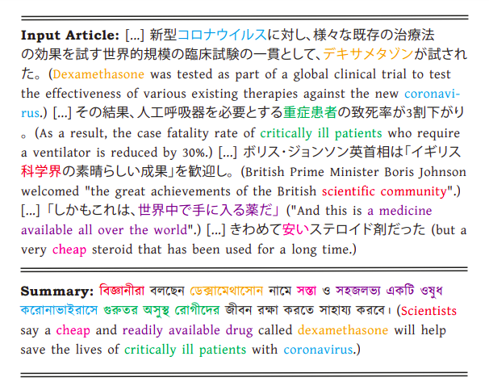
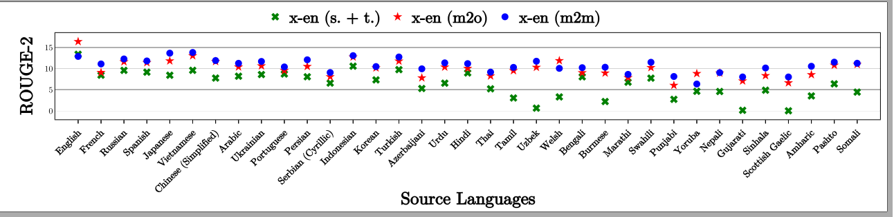
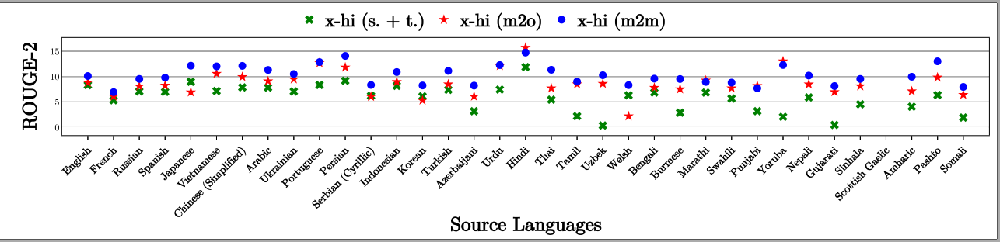
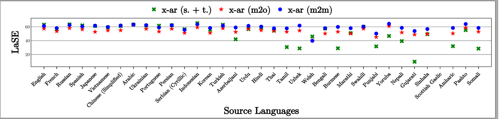
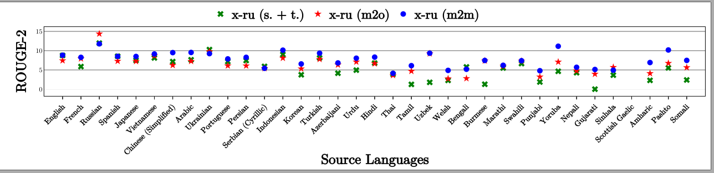

# CrossSum

This repository contains the code, data, and models of the paper titled [**"CrossSum: Beyond English-Centric Cross-Lingual Abstractive Text Summarization for 1500+ Language Pairs"**](https://arxiv.org/abs/2112.08804) accepted for publication in Proceedings of the 61st Annual Meeting of the Association for Computational Linguistics (ACL’23), July 9-14, 2023.


## Table of Contents

- [CrossSum](#crosssum)
  - [Table of Contents](#table-of-contents)
  - [Datasets](#datasets)
  - [Training & Evaluation](#training--evaluation)
  - [Language-agnostic Summary Evaluation](#language-agnostic-summary-evaluation)
  - [Models](#models)
  - [Benchmarks](#benchmarks)
  - [License](#license)
  - [Citation](#citation)


## Datasets
  
***Disclaimer: You must agree to the [license](#license) and terms of use before using the dataset.***

An example article-summary pair from the `Japanese-Bengali` pair of the ***CrossSum*** dataset with corresponding English translations is given below:



The corresponding complete datapoint in the dataset is as follows:
```
{
    "source_url": "https://www.bbc.com/japanese/53074000",
    "target_url": "https://www.bbc.com/bengali/news-53064712",
    "summary": "বিজ্ঞানীরা বলছেন ডেক্সামেথাসোন নামে সস্তা ও সহজলভ্য একটি ওষুধ করোনাভাইরাসে গুরুতর অসুস্থ রোগীদের জীবন রক্ষা করতে সাহায্য করবে।",
    "text": "ミシェル･ロバーツ、BBCニュースオンライン健康担当編集長 英オックスフォード大学の研究チームによると、低用量のデキサメタゾンは新型ウイルスとの戦いで画期的な突破口になる。 新型コロナウイルスに対し、様々な既存の治療法の効果を試す世界的規模の臨床試験の一貫として、デキサメタゾンが試された。 その結果、人工呼吸器を必要とする重症患者の致死率が3割下がり、酸素供給を必要とする患者の場合は2割下がった。 新型ウイルスのパンデミック（世界的流行）の初期からイギリスでデキサメタゾンを治療に使用していた場合、最大5000人の命が救えたはずだと研究者たちは言う。 さらに、新型コロナウイルスによる感染症「COVID-19」の患者が多く出ている貧しい国にとっても、安価なデキサメタゾンを使う治療は大いに役立つと期待される。 重症者の致死率が大幅に下がる イギリス政府は20万人分の投与量を備蓄しており、国民医療制度の国民保健サービス（NHS）で患者への使用を開始する方針を示した。 ボリス･ジョンソン英首相は「イギリス科学界の素晴らしい成果」を歓迎し、「たとえ感染の第2波が来ても備蓄が足りるよう、数を確保するための措置をとった」と述べた。 イングランド首席医務官クリス・ウィッティー教授は、「COVID-19にとってこれまでで一番重要な臨床試験結果だ。手に入りやすく安全でなじみのある薬によって、酸素供給や人工呼吸器が必要な人の致死率が大幅に下がった。（中略）この発見が世界中で人命を救う」と評価した。 ＜関連記事＞ 新型コロナウイルスに20人が感染した場合、19人は入院しないまま回復する。入院する人もほとんどは回復するものの、重症化して酸素供給や人工呼吸器を必要とする人もいる。 デキサメタゾンはこうした重症患者の治療に効果があるもよう。 新型ウイルスに感染した患者の体内では、ウイルスと戦う免疫系が暴走することがある。その免疫系の過剰反応による体の損傷を、デキサメタゾンが緩和するものとみられる。 「サイトカイン・ストーム」と呼ばれる免疫系の過剰反応が、患者の命を奪うこともある。 デキサメタゾンはすでに抗炎症剤として、ぜんそくや皮膚炎など様々な症状の治療に使われている。 初めて致死率を下げる薬 オックスフォード大学が主導する臨床試験は、約2000人の入院患者にデキサメタゾンを投与。それ以外の4000人以上の患者と容体を比較した。 人工呼吸器を使用する患者については、死亡リスクが40％から28％に下がった。 酸素供給する患者は、死亡リスクが25％から20％に下がった。 研究チームのピーター・ホービー教授は、「今のところ、致死率を実際に下げる結果が出たのは、この薬だけだ。しかも、致死率をかなり下げる。画期的な突破口だ」と話した。 研究を主導するマーティン・ランドレイ教授によると、人工呼吸器を使う患者の8人に1人、ならびに酸素供給治療を受ける患者の20-25人に1人が、デキサメタゾンで救えることが分かったという。 「これはきわめて明確なメリットだ」と教授は言う。 「最大10日間、デキサメタゾンを投与するという治療法で、費用は患者1人あたり1日約5ポンド（約670円）。つまり、35ポンド（約4700円）で人ひとりの命が救える」 「しかもこれは、世界中で手に入る薬だ」 状況が許す限り、新型コロナウイルスで入院中の患者にはただちに投与を開始すべきだと、ランドレイ教授は促した。 ただし、自宅で自己治療するために薬局に買いに行くべきではないと言う。 デキサメタゾンは、呼吸補助を必要としない軽症の患者には効果がないもよう。 3月に始動した新型コロナウイルス治療薬の無作為化臨床試験「リカバリー・トライアル」は、抗マラリア薬「ヒドロキシクロロキン」も調べたものの、心臓疾患や致死率の悪化につながるという懸念から、ヒドロキシクロロキンについては試験を中止した。 一方で、感染者の回復にかかる時間を短縮するとみられるレムデシビルは、すでにNHSの保険対象になり治療現場で使われている。 ＜解説＞ ファーガス・ウォルシュBBC健康担当編集委員 COVID-19の死者を減らすと初めて立証された薬は、高価な新しい薬ではなく、古くからずっと使われてきた、きわめて安いステロイド剤だった。 世界中の患者が直ちにその恩恵を受けることになるので、これは歓迎すべき発見だ。 この臨床試験の最新成果がこれほど急いで発表されたのは、そのためだ。とてつもない影響を世界中にもたらすので。 デキサメタゾンは1960年代初めから、関節リウマチやぜんそくなど、幅広い症状の治療に使われてきた。 これまでは、人工呼吸器を必要とするCOVID-19患者の半数が亡くなってきた。その致死率を3割減らすというのは、絶大な効果だ。 集中治療室では点滴で投与する。もう少し軽症な患者には、錠剤で与える。 これまでのところ、COVID-19患者に効果があると証明された薬は、エボラ治療薬のレムデシビルだけだった。 レムデシビルは症状の回復期間を15日から11日に短縮する。しかし、致死率を下げると言えるだけの証拠は出ていなかった。 デキサメタゾンと異なり、レムデシビルは数の少ない新薬で、薬価もまだ公表されていない。"
}
```

The dataset files are organized in `.jsonl` format  i.e. one JSON per line. **Download the dataset from [here](https://drive.google.com/file/d/11yCJxK5necOyZBxcJ6jncdCFgNxrsl4m/view).** It is also available on [Huggingface Datasets](https://huggingface.co/datasets/csebuetnlp/CrossSum)

No. of total examples for each language pair are as follows:


Language (ISO 639-1-Code) | am | ar | az | bn | my | zh-CN | zh-TW | en | fr | gu | ha | hi | ig | id | ja | rn | ko | ky | mr | np | om | ps | fa | pcm | pt | pa | ru | gd | sr | sr | si | so | es | sw | ta | te | th | ti | tr | uk | ur | uz | vi | cy | yo 
----- | ----- | ----- | ----- | ----- | ----- | ----- | ----- | ----- | ----- | ----- | ----- | ----- | ----- | ----- | ----- | ----- | ----- | ----- | ----- | ----- | ----- | ----- | ----- | ----- | ----- | ----- | ----- | ----- | ----- | ----- | ----- | ----- | ----- | ----- | ----- | ----- | ----- | ----- | ----- | ----- | ----- | ----- | ----- | ----- | ----- 
am | -- | 667 | 100 | 272 | 95 | 179 | 167 | 1456 | 358 | 173 | 221 | 377 | 26 | 494 | 264 | 423 | 244 | 92 | 221 | 301 | 21 | 192 | 431 | 209 | 307 | 189 | 347 | 0 | 357 | 365 | 62 | 309 | 351 | 378 | 390 | 329 | 124 | 131 | 435 | 345 | 409 | 41 | 285 | 1 | 67 
ar | 667 | -- | 787 | 804 | 652 | 2968 | 2843 | 9653 | 989 | 475 | 747 | 3665 | 86 | 6084 | 1188 | 876 | 707 | 299 | 559 | 854 | 9 | 2161 | 4186 | 436 | 2539 | 547 | 5564 | 1 | 1109 | 1145 | 315 | 1049 | 3654 | 1186 | 1311 | 877 | 367 | 27 | 4147 | 3457 | 4935 | 388 | 2666 | 38 | 141 
az | 100 | 787 | -- | 277 | 84 | 371 | 334 | 1317 | 208 | 192 | 126 | 748 | 28 | 1111 | 231 | 188 | 155 | 221 | 194 | 242 | 1 | 252 | 817 | 91 | 678 | 190 | 2238 | 4 | 289 | 283 | 124 | 367 | 704 | 539 | 515 | 245 | 140 | 2 | 1495 | 1383 | 966 | 199 | 725 | 30 | 42 
bn | 272 | 804 | 277 | -- | 139 | 318 | 284 | 1549 | 317 | 559 | 231 | 1396 | 35 | 1076 | 342 | 298 | 352 | 154 | 586 | 668 | 2 | 300 | 790 | 135 | 764 | 580 | 838 | 0 | 562 | 564 | 151 | 412 | 701 | 471 | 919 | 793 | 245 | 6 | 860 | 688 | 1382 | 98 | 527 | 37 | 61 
my | 95 | 652 | 84 | 139 | -- | 356 | 314 | 685 | 90 | 96 | 74 | 528 | 12 | 761 | 144 | 100 | 112 | 58 | 89 | 152 | 1 | 234 | 426 | 39 | 230 | 86 | 535 | 0 | 115 | 123 | 87 | 79 | 431 | 86 | 185 | 147 | 71 | 4 | 449 | 350 | 591 | 62 | 447 | 4 | 12 
zh-CN | 179 | 2968 | 371 | 318 | 356 | -- | 47101 | 4975 | 348 | 201 | 159 | 1379 | 38 | 2851 | 1017 | 240 | 412 | 139 | 240 | 275 | 14 | 559 | 1111 | 149 | 1371 | 250 | 2572 | 2 | 504 | 530 | 166 | 323 | 2002 | 412 | 511 | 353 | 269 | 11 | 1511 | 1619 | 1651 | 176 | 1858 | 33 | 39 
zh-TW | 167 | 2843 | 334 | 284 | 314 | 47101 | -- | 4884 | 331 | 174 | 150 | 1213 | 35 | 2588 | 953 | 209 | 382 | 131 | 213 | 252 | 16 | 501 | 967 | 141 | 1271 | 226 | 2286 | 1 | 453 | 494 | 150 | 302 | 1873 | 383 | 465 | 335 | 250 | 12 | 1294 | 1464 | 1444 | 158 | 1663 | 31 | 38 
en | 1456 | 9653 | 1317 | 1549 | 685 | 4975 | 4884 | -- | 1889 | 978 | 913 | 4728 | 144 | 10040 | 3040 | 1878 | 1673 | 490 | 1181 | 1614 | 38 | 1522 | 4680 | 1074 | 4744 | 1330 | 9080 | 128 | 3760 | 3809 | 532 | 2141 | 6910 | 2701 | 3156 | 2121 | 1020 | 58 | 5676 | 6562 | 6320 | 450 | 4574 | 2655 | 229 
fr | 358 | 989 | 208 | 317 | 90 | 348 | 331 | 1889 | -- | 242 | 477 | 616 | 106 | 1018 | 274 | 735 | 264 | 124 | 241 | 323 | 4 | 196 | 602 | 439 | 921 | 247 | 849 | 2 | 555 | 569 | 98 | 502 | 990 | 872 | 425 | 380 | 185 | 10 | 829 | 721 | 766 | 76 | 438 | 40 | 159 
gu | 173 | 475 | 192 | 559 | 96 | 201 | 174 | 978 | 242 | -- | 147 | 5170 | 34 | 710 | 228 | 183 | 268 | 106 | 2091 | 561 | 1 | 246 | 522 | 101 | 529 | 2210 | 582 | 0 | 331 | 345 | 125 | 261 | 540 | 300 | 1762 | 2066 | 164 | 5 | 631 | 508 | 1619 | 80 | 450 | 21 | 54 
ha | 221 | 747 | 126 | 231 | 74 | 159 | 150 | 913 | 477 | 147 | -- | 460 | 202 | 901 | 157 | 485 | 135 | 61 | 159 | 239 | 5 | 229 | 487 | 529 | 375 | 157 | 525 | 1 | 258 | 258 | 49 | 391 | 463 | 568 | 299 | 260 | 87 | 9 | 519 | 400 | 526 | 59 | 352 | 30 | 362 
hi | 377 | 3665 | 748 | 1396 | 528 | 1379 | 1213 | 4728 | 616 | 5170 | 460 | -- | 65 | 5627 | 623 | 489 | 520 | 234 | 3831 | 1357 | 4 | 1519 | 5351 | 192 | 6563 | 4052 | 4622 | 1 | 809 | 807 | 449 | 747 | 2931 | 893 | 3711 | 3762 | 378 | 7 | 3694 | 3935 | 15666 | 352 | 3738 | 77 | 79 
ig | 26 | 86 | 28 | 35 | 12 | 38 | 35 | 144 | 106 | 34 | 202 | 65 | -- | 113 | 24 | 107 | 32 | 16 | 51 | 36 | 3 | 11 | 49 | 255 | 61 | 39 | 79 | 0 | 51 | 51 | 13 | 77 | 91 | 151 | 52 | 54 | 18 | 5 | 91 | 83 | 61 | 15 | 65 | 6 | 296 
id | 494 | 6084 | 1111 | 1076 | 761 | 2851 | 2588 | 10040 | 1018 | 710 | 901 | 5627 | 113 | -- | 1274 | 994 | 774 | 347 | 745 | 1104 | 8 | 1430 | 3892 | 367 | 4409 | 725 | 7588 | 7 | 1387 | 1379 | 470 | 1312 | 4547 | 1873 | 1886 | 1131 | 599 | 9 | 5663 | 4829 | 6476 | 432 | 4810 | 145 | 174 
ja | 264 | 1188 | 231 | 342 | 144 | 1017 | 953 | 3040 | 274 | 228 | 157 | 623 | 24 | 1274 | -- | 372 | 654 | 140 | 302 | 424 | 2 | 266 | 1014 | 152 | 706 | 269 | 1517 | 2 | 550 | 571 | 109 | 387 | 950 | 425 | 641 | 425 | 305 | 5 | 1242 | 1013 | 797 | 49 | 908 | 25 | 33 
rn | 423 | 876 | 188 | 298 | 100 | 240 | 209 | 1878 | 735 | 183 | 485 | 489 | 107 | 994 | 372 | -- | 283 | 106 | 242 | 369 | 18 | 228 | 684 | 398 | 526 | 206 | 711 | 0 | 443 | 450 | 77 | 584 | 607 | 1186 | 521 | 363 | 149 | 13 | 724 | 610 | 617 | 59 | 631 | 20 | 180 
ko | 244 | 707 | 155 | 352 | 112 | 412 | 382 | 1673 | 264 | 268 | 135 | 520 | 32 | 774 | 654 | 283 | -- | 99 | 319 | 445 | 1 | 150 | 596 | 130 | 587 | 264 | 649 | 0 | 522 | 543 | 81 | 234 | 613 | 324 | 541 | 452 | 197 | 5 | 680 | 616 | 532 | 54 | 530 | 12 | 45 
ky | 92 | 299 | 221 | 154 | 58 | 139 | 131 | 490 | 124 | 106 | 61 | 234 | 16 | 347 | 140 | 106 | 99 | -- | 107 | 167 | 4 | 102 | 252 | 59 | 251 | 118 | 1013 | 1 | 206 | 211 | 45 | 145 | 279 | 150 | 206 | 174 | 109 | 3 | 346 | 508 | 270 | 113 | 201 | 12 | 23 
mr | 221 | 559 | 194 | 586 | 89 | 240 | 213 | 1181 | 241 | 2091 | 159 | 3831 | 51 | 745 | 302 | 242 | 319 | 107 | -- | 630 | 1 | 232 | 608 | 138 | 524 | 1797 | 675 | 0 | 419 | 436 | 129 | 270 | 603 | 332 | 1776 | 1886 | 196 | 11 | 706 | 596 | 1395 | 79 | 473 | 16 | 48 
np | 301 | 854 | 242 | 668 | 152 | 275 | 252 | 1614 | 323 | 561 | 239 | 1357 | 36 | 1104 | 424 | 369 | 445 | 167 | 630 | -- | 1 | 303 | 916 | 134 | 706 | 545 | 849 | 2 | 553 | 538 | 164 | 420 | 687 | 513 | 994 | 741 | 217 | 7 | 930 | 741 | 1156 | 84 | 719 | 39 | 65 
om | 21 | 9 | 1 | 2 | 1 | 14 | 16 | 38 | 4 | 1 | 5 | 4 | 3 | 8 | 2 | 18 | 1 | 4 | 1 | 1 | -- | 2 | 3 | 11 | 4 | 6 | 8 | 0 | 2 | 3 | 0 | 6 | 7 | 5 | 2 | 2 | 1 | 103 | 5 | 10 | 1 | 4 | 2 | 0 | 7 
ps | 192 | 2161 | 252 | 300 | 234 | 559 | 501 | 1522 | 196 | 246 | 229 | 1519 | 11 | 1430 | 266 | 228 | 150 | 102 | 232 | 303 | 2 | -- | 2815 | 94 | 594 | 249 | 1246 | 0 | 235 | 242 | 156 | 304 | 766 | 314 | 441 | 314 | 92 | 8 | 1049 | 818 | 2833 | 156 | 657 | 7 | 32 
fa | 431 | 4186 | 817 | 790 | 426 | 1111 | 967 | 4680 | 602 | 522 | 487 | 5351 | 49 | 3892 | 1014 | 684 | 596 | 252 | 608 | 916 | 3 | 2815 | -- | 186 | 5512 | 541 | 4328 | 0 | 1028 | 1023 | 276 | 812 | 2512 | 1002 | 1250 | 797 | 364 | 8 | 3695 | 3567 | 6752 | 313 | 3190 | 66 | 74 
pcm | 209 | 436 | 91 | 135 | 39 | 149 | 141 | 1074 | 439 | 101 | 529 | 192 | 255 | 367 | 152 | 398 | 130 | 59 | 138 | 134 | 11 | 94 | 186 | -- | 227 | 112 | 322 | 0 | 234 | 246 | 28 | 219 | 314 | 436 | 232 | 162 | 85 | 28 | 287 | 280 | 232 | 18 | 170 | 9 | 462 
pt | 307 | 2539 | 678 | 764 | 230 | 1371 | 1271 | 4744 | 921 | 529 | 375 | 6563 | 61 | 4409 | 706 | 526 | 587 | 251 | 524 | 706 | 4 | 594 | 5512 | 227 | -- | 579 | 4452 | 7 | 1371 | 1341 | 231 | 602 | 7112 | 983 | 1042 | 820 | 468 | 3 | 3483 | 4421 | 6759 | 186 | 3754 | 110 | 97 
pa | 189 | 547 | 190 | 580 | 86 | 250 | 226 | 1330 | 247 | 2210 | 157 | 4052 | 39 | 725 | 269 | 206 | 264 | 118 | 1797 | 545 | 6 | 249 | 541 | 112 | 579 | -- | 629 | 0 | 410 | 404 | 128 | 283 | 585 | 357 | 1726 | 1892 | 200 | 10 | 643 | 570 | 1515 | 73 | 431 | 16 | 44 
ru | 347 | 5564 | 2238 | 838 | 535 | 2572 | 2286 | 9080 | 849 | 582 | 525 | 4622 | 79 | 7588 | 1517 | 711 | 649 | 1013 | 675 | 849 | 8 | 1246 | 4328 | 322 | 4452 | 629 | -- | 5 | 1495 | 1460 | 373 | 1166 | 4864 | 1672 | 1628 | 892 | 595 | 7 | 6223 | 22241 | 5309 | 809 | 3963 | 134 | 125 
gd | 0 | 1 | 4 | 0 | 0 | 2 | 1 | 128 | 2 | 0 | 1 | 1 | 0 | 7 | 2 | 0 | 0 | 1 | 0 | 2 | 0 | 0 | 0 | 0 | 7 | 0 | 5 | -- | 2 | 3 | 2 | 1 | 3 | 1 | 0 | 0 | 1 | 0 | 6 | 5 | 2 | 1 | 3 | 36 | 2 
sr | 357 | 1109 | 289 | 562 | 115 | 504 | 453 | 3760 | 555 | 331 | 258 | 809 | 51 | 1387 | 550 | 443 | 522 | 206 | 419 | 553 | 2 | 235 | 1028 | 234 | 1371 | 410 | 1495 | 2 | -- | 9041 | 127 | 377 | 1235 | 574 | 761 | 691 | 340 | 6 | 1247 | 1512 | 1021 | 109 | 685 | 42 | 69 
sr | 365 | 1145 | 283 | 564 | 123 | 530 | 494 | 3809 | 569 | 345 | 258 | 807 | 51 | 1379 | 571 | 450 | 543 | 211 | 436 | 538 | 3 | 242 | 1023 | 246 | 1341 | 404 | 1460 | 3 | 9041 | -- | 137 | 382 | 1260 | 568 | 775 | 699 | 347 | 10 | 1229 | 1498 | 1009 | 112 | 639 | 45 | 79 
si | 62 | 315 | 124 | 151 | 87 | 166 | 150 | 532 | 98 | 125 | 49 | 449 | 13 | 470 | 109 | 77 | 81 | 45 | 129 | 164 | 0 | 156 | 276 | 28 | 231 | 128 | 373 | 2 | 127 | 137 | -- | 137 | 260 | 189 | 348 | 173 | 69 | 7 | 301 | 306 | 510 | 38 | 216 | 5 | 15 
so | 309 | 1049 | 367 | 412 | 79 | 323 | 302 | 2141 | 502 | 261 | 391 | 747 | 77 | 1312 | 387 | 584 | 234 | 145 | 270 | 420 | 6 | 304 | 812 | 219 | 602 | 283 | 1166 | 1 | 377 | 382 | 137 | -- | 689 | 1020 | 723 | 384 | 178 | 19 | 968 | 875 | 1000 | 75 | 724 | 20 | 116 
es | 351 | 3654 | 704 | 701 | 431 | 2002 | 1873 | 6910 | 990 | 540 | 463 | 2931 | 91 | 4547 | 950 | 607 | 613 | 279 | 603 | 687 | 7 | 766 | 2512 | 314 | 7112 | 585 | 4864 | 3 | 1235 | 1260 | 260 | 689 | -- | 1047 | 1073 | 827 | 469 | 10 | 3645 | 3130 | 3060 | 290 | 2330 | 59 | 133 
sw | 378 | 1186 | 539 | 471 | 86 | 412 | 383 | 2701 | 872 | 300 | 568 | 893 | 151 | 1873 | 425 | 1186 | 324 | 150 | 332 | 513 | 5 | 314 | 1002 | 436 | 983 | 357 | 1672 | 1 | 574 | 568 | 189 | 1020 | 1047 | -- | 929 | 492 | 261 | 10 | 1348 | 1309 | 1253 | 90 | 936 | 37 | 219 
ta | 390 | 1311 | 515 | 919 | 185 | 511 | 465 | 3156 | 425 | 1762 | 299 | 3711 | 52 | 1886 | 641 | 521 | 541 | 206 | 1776 | 994 | 2 | 441 | 1250 | 232 | 1042 | 1726 | 1628 | 0 | 761 | 775 | 348 | 723 | 1073 | 929 | -- | 2278 | 400 | 14 | 1486 | 1423 | 2404 | 134 | 1092 | 32 | 68 
te | 329 | 877 | 245 | 793 | 147 | 353 | 335 | 2121 | 380 | 2066 | 260 | 3762 | 54 | 1131 | 425 | 363 | 452 | 174 | 1886 | 741 | 2 | 314 | 797 | 162 | 820 | 1892 | 892 | 0 | 691 | 699 | 173 | 384 | 827 | 492 | 2278 | -- | 306 | 11 | 893 | 832 | 1748 | 107 | 644 | 21 | 61 
th | 124 | 367 | 140 | 245 | 71 | 269 | 250 | 1020 | 185 | 164 | 87 | 378 | 18 | 599 | 305 | 149 | 197 | 109 | 196 | 217 | 1 | 92 | 364 | 85 | 468 | 200 | 595 | 1 | 340 | 347 | 69 | 178 | 469 | 261 | 400 | 306 | -- | 5 | 477 | 480 | 414 | 37 | 357 | 10 | 26 
ti | 131 | 27 | 2 | 6 | 4 | 11 | 12 | 58 | 10 | 5 | 9 | 7 | 5 | 9 | 5 | 13 | 5 | 3 | 11 | 7 | 103 | 8 | 8 | 28 | 3 | 10 | 7 | 0 | 6 | 10 | 7 | 19 | 10 | 10 | 14 | 11 | 5 | -- | 8 | 8 | 4 | 2 | 5 | 0 | 6 
tr | 435 | 4147 | 1495 | 860 | 449 | 1511 | 1294 | 5676 | 829 | 631 | 519 | 3694 | 91 | 5663 | 1242 | 724 | 680 | 346 | 706 | 930 | 5 | 1049 | 3695 | 287 | 3483 | 643 | 6223 | 6 | 1247 | 1229 | 301 | 968 | 3645 | 1348 | 1486 | 893 | 477 | 8 | -- | 4108 | 4340 | 370 | 2981 | 126 | 130 
uk | 345 | 3457 | 1383 | 688 | 350 | 1619 | 1464 | 6562 | 721 | 508 | 400 | 3935 | 83 | 4829 | 1013 | 610 | 616 | 508 | 596 | 741 | 10 | 818 | 3567 | 280 | 4421 | 570 | 22241 | 5 | 1512 | 1498 | 306 | 875 | 3130 | 1309 | 1423 | 832 | 480 | 8 | 4108 | -- | 4290 | 442 | 3017 | 108 | 89 
ur | 409 | 4935 | 966 | 1382 | 591 | 1651 | 1444 | 6320 | 766 | 1619 | 526 | 15666 | 61 | 6476 | 797 | 617 | 532 | 270 | 1395 | 1156 | 1 | 2833 | 6752 | 232 | 6759 | 1515 | 5309 | 2 | 1021 | 1009 | 510 | 1000 | 3060 | 1253 | 2404 | 1748 | 414 | 4 | 4340 | 4290 | -- | 389 | 3723 | 72 | 88 
uz | 41 | 388 | 199 | 98 | 62 | 176 | 158 | 450 | 76 | 80 | 59 | 352 | 15 | 432 | 49 | 59 | 54 | 113 | 79 | 84 | 4 | 156 | 313 | 18 | 186 | 73 | 809 | 1 | 109 | 112 | 38 | 75 | 290 | 90 | 134 | 107 | 37 | 2 | 370 | 442 | 389 | -- | 257 | 10 | 15 
vi | 285 | 2666 | 726 | 527 | 447 | 1858 | 1663 | 4575 | 438 | 450 | 352 | 3738 | 65 | 4810 | 908 | 631 | 530 | 201 | 473 | 719 | 2 | 657 | 3190 | 170 | 3755 | 431 | 3963 | 3 | 685 | 639 | 216 | 724 | 2330 | 936 | 1092 | 644 | 357 | 5 | 2982 | 3017 | 3723 | 257 | -- | 106 | 76 
cy | 1 | 38 | 30 | 37 | 4 | 33 | 31 | 2655 | 40 | 21 | 30 | 77 | 6 | 145 | 25 | 20 | 12 | 12 | 16 | 39 | 0 | 7 | 66 | 9 | 110 | 16 | 134 | 36 | 42 | 45 | 5 | 20 | 59 | 37 | 32 | 21 | 10 | 0 | 126 | 108 | 72 | 10 | 106 | -- | 8 
yo | 67 | 141 | 42 | 61 | 12 | 39 | 38 | 229 | 159 | 54 | 362 | 79 | 296 | 174 | 33 | 180 | 45 | 23 | 48 | 65 | 7 | 32 | 74 | 462 | 97 | 44 | 125 | 2 | 69 | 79 | 15 | 116 | 133 | 219 | 68 | 61 | 26 | 6 | 130 | 89 | 88 | 15 | 76 | 8 | -- 


## Training & Evaluation
  * See [training and evaluation module.](seq2seq/)

## Language-agnostic Summary Evaluation
  * See [LaSE module.](LaSE/)

## Models

The following model checkpoints from the paper are available at [huggingface model hub](https://huggingface.co/csebuetnlp):

Model Name        |Training type| Sampling type | Pivot Language |
--------------|-------------|----------------|---------------|
[mT5_m2m_crossSum](https://huggingface.co/csebuetnlp/mT5_m2m_crossSum)| many-to-many | multistage | N/A |
[mT5_m2o_english_crossSum](https://huggingface.co/csebuetnlp/mT5_m2o_english_crossSum) | many-to-one | unistage | English |
[mT5_m2o_arabic_crossSum](https://huggingface.co/csebuetnlp/mT5_m2o_arabic_crossSum) | many-to-one | unistage | Arabic |
[mT5_m2o_russain_crossSum](https://huggingface.co/csebuetnlp/mT5_m2o_russian_crossSum) | many-to-one | unistage | Russian |
[mT5_m2o_hindi_crossSum](https://huggingface.co/csebuetnlp/mT5_m2o_hindi_crossSum) | many-to-one | unistage | Hindi |
[mT5_m2o_chinese_simplified_crossSum](https://huggingface.co/csebuetnlp/mT5_m2o_chinese_simplified_crossSum) | many-to-one | unistage | Chinese (Simplified) |


## Benchmarks

Some of the benchmark results for different pivot languages **as targets** are shown below. For all results, refer to the paper.





  
## License
Contents of this repository are restricted to only non-commercial research purposes under the [Creative Commons Attribution-NonCommercial-ShareAlike 4.0 International License (CC BY-NC-SA 4.0)](https://creativecommons.org/licenses/by-nc-sa/4.0/). Copyright of the dataset contents belongs to the original copyright holders.

## Citation
If you use any of the datasets, models or code modules, please cite the following paper:
```
@article{bhattacharjee2021crosssum,
  author    = {Abhik Bhattacharjee and Tahmid Hasan and Wasi Uddin Ahmad and Yuan-Fang Li and Yong-bin Kang and Rifat Shahriyar},
  title     = {CrossSum: Beyond English-Centric Cross-Lingual Abstractive Text Summarization for 1500+ Language Pairs},
  journal   = {CoRR},
  volume    = {abs/2112.08804},
  year      = {2021},
  url       = {https://arxiv.org/abs/2112.08804},
  eprinttype = {arXiv},
  eprint    = {2112.08804}
}
```
